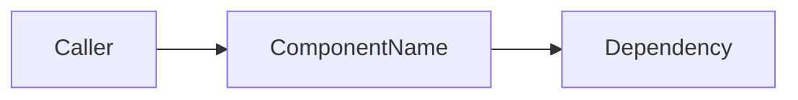
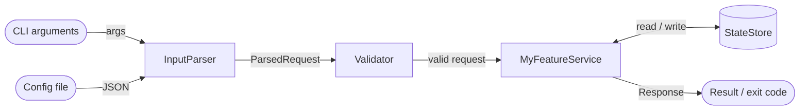

# [Feature/Project Name] — Design Document

| | |
|---|---|
| **Author(s)** | |
| **Status** | Draft / In Review / Approved / Implemented |
| **Date** | |
| **Related Issues/Tickets** | |
| **Revision** | v0.1 |

---

## Table Of Contents

- [Summary](#summary)
- [Motivation / Problem Statement](#motivation--problem-statement)
- [Abbreviations And Terminology](#abbreviations-and-terminology)
- [Background / Context](#background--context)
- [Requirements](#requirements)
  - [Functional Requirements](#functional-requirements)
  - [Non-Functional Requirements](#non-functional-requirements)
- [Design Scope](#design-scope)
  - [In Scope](#in-scope)
  - [Out Of Scope](#out-of-scope)
  - [Assumptions And Constraints](#assumptions-and-constraints)
- [High-Level Design](#high-level-design)
  - [Components](#components)
  - [Data Flow](#data-flow)
  - [Public API](#public-api)
  - [Configuration And Runtime Options](#configuration-and-runtime-options)
- [Low-Level Design](#low-level-design)
  - [Types And Interfaces](#types-and-interfaces)
  - [Core Algorithms And Logic](#core-algorithms-and-logic)
  - [Threading And Concurrency](#threading-and-concurrency)
  - [Resource Management](#resource-management)
  - [Error Handling Strategy](#error-handling-strategy)
- [Alternatives Considered](#alternatives-considered)
  - [Option A](#option-a)
  - [Option B](#option-b)
- [Dependencies](#dependencies)
- [Performance Considerations](#performance-considerations)
- [Testing Strategy](#testing-strategy)
- [Build and Tooling](#build-and-tooling)
- [Deployment and Migration](#deployment-and-migration)
- [Risks](#risks)
- [Security Considerations](#security-considerations)
- [Open Questions](#open-questions)
- [Related Documents](#related-documents)

---

## Summary

One or two paragraphs describing what this feature/project does and why it matters. Should be understandable by someone outside the immediate team.

---

## Motivation / Problem Statement

Keep this section short. It should answer:
- What problem are we solving?
- Why does it need solving now?
- What happens if we don't do this?

---

## Abbreviations And Terminology

Define every non-obvious term used in this document.

| Term | Definition |
|------|------------|
| `<term>` | `<definition>` |

Rule: any term that is not universally obvious must appear here before use elsewhere.

---

## Background / Context

Relevant existing systems, prior functionality, related components, and any domain knowledge a reviewer needs to evaluate the design. Extend [Motivation / Problem Statement](#motivation--problem-statement) here; keep the motivation section short and put the detail in this section.

- Related protocols, standards, or domain concepts a reviewer needs to understand.
- How the problem manifests today (bug, missing capability, technical debt) and affected code paths or components.
- Existing systems in this repo that interact with or constrain the design.
- Prior functionality: how similar libraries, products, or internal components solve the same problem.
- Relevant history, constraints, or prior attempts that impact this design.

---

## Requirements

### Functional Requirements

Each requirement should be independently testable.

Example:

- The system shall validate configuration before initialization.
- The system shall reject duplicate identifiers.
- The system shall support incremental updates.

### Non-Functional Requirements

- **Performance:** latency/throughput targets, hot-path constraints
- **Memory:** budget, allocation patterns (stack vs heap), footprint limits
- **Concurrency/Thread-safety:** expected threading model
- **Portability:** target platforms/compilers (e.g., GCC/Clang/MSVC, Linux/Windows/embedded)
- **ABI/API stability:** is this a public API? Versioning concerns?
- **Real-time constraints:** if applicable (no dynamic allocation, bounded execution time, etc.)

---

## Design Scope

Describe what this design covers, what it deliberately excludes, and any assumptions or constraints that influence the design.

### In Scope

- Components, features, and behaviors implemented by this design.
- APIs or interfaces introduced or modified.
- Expected interactions with existing components.

### Out Of Scope

- Related work intentionally deferred.
- Functionality explicitly not addressed by this design.
- Future enhancements not required for this implementation.

### Assumptions And Constraints

- Platform, compiler, or language requirements.
- Existing architectural or ABI/API compatibility constraints.
- Project-specific limitations (for example, no exceptions, no RTTI, real-time requirements).

---

## High-Level Design

Describe the big picture: components, responsibilities, and relationships. Include a diagram (component, sequence, or class) of the major building blocks, as Mermaid, ASCII art, or a linked image. For example:



### Components

| Component | Responsibility | Depends On |
|---|---|---|
| `ClassA` | | |
| `ClassB` | | |

### Data Flow

Describes how data moves through the system. It should answer:
- Where does the data come from?
- Which components process it?
- How is it transformed?
- Where is it stored (if anywhere)?
- Where does it go next?
- What are the major decision points?

Include a data flow diagram. For example:



### Public API

Describe the outward-facing API at a conceptual level. Detailed signatures belong in [Types And Interfaces](#types-and-interfaces).

| API surface | Consumers | Stability |
|-------------|-----------|-----------|
| `<class / free function / namespace>` | `<who uses it>` | experimental / stable / internal |

### Configuration And Runtime Options

| Option | Type | Default | Description |
|--------|------|---------|-------------|
| `<name>` | CMake option / env var / CLI flag | `<default>` | `<behavior>` |

---

## Low-Level Design

### Types And Interfaces

Document the API between components. Include headers, key types, and function contracts.

**Header:** `src/<component>/<component>.h`

```cpp
namespace project::<component> {

// TODO: classes, enums, type aliases, function declarations

} // namespace project::<component>
```

### Core Algorithms And Logic

Describe implementation approach using pseudocode, sequence notes, or selective real code.

```
function process(input):
    validate(input)
    result = transform(input)
    return result
```

For every non-trivial algorithm document:

- Time complexity
- Space complexity
- Invariants
- Edge cases

### Threading And Concurrency

- Threading assumptions (single-threaded, thread-per-request, thread pool, lock-free).
- Synchronization primitives used (`std::mutex`, `std::atomic`, etc.).
- Data races / reentrancy considerations.

### Resource Management

- Ownership model for heap, file handles, sockets, etc.
- RAII types introduced or reused.
- Lifetime relationships between objects (who owns whom).
- Allocation strategy (stack, heap, custom allocators, arenas/pools).
- Expected allocation frequency on hot paths.
- Any use of placement new, custom allocators, or `std::pmr`.

### Error Handling Strategy

Failure modes and recovery behavior:
- Expected errors
- Unexpected errors
- Logging strategy
- Retry policy
- Error propagation
- Recovery behavior

---

## Alternatives Considered

### Option A
- Pros
- Cons
- Reason rejected

---

## Dependencies

| Dependency | Version | Source | License | Why needed |
|------------|---------|--------|---------|------------|
| `<library>` | `<version>` | `<FetchContent / system / submodule>` | `<License>` | `<reason>` |

Note impact on build time, binary size, and security update process.

---

## Performance Considerations

Document allocations, hot paths, cache behavior, and regressions to watch for:
- Startup time
- Memory usage
- Latency
- Throughput
- Allocation behavior

---

## Testing Strategy

- **Unit tests:** coverage targets
- **Integration tests:** scope
- **Fuzz testing:** if applicable
- **Benchmark tests:** framework (Google Benchmark), regression thresholds
- **Static analysis:** clang-tidy, cppcheck, sanitizers (ASan/UBSan/TSan) to be run
- **Coverage:** Expected line/branch coverage

---

## Build and Tooling

- Changes to build system (CMake targets, new flags)
- New third-party dependencies to vendor/fetch
- Compiler/standard version requirements (e.g., requires C++20)
- Impact on build times

---

## Deployment and Migration

- Is this backward compatible?
- Feature flag / staged rollout plan
- Deprecation plan for anything being replaced

---

## Risks

Known or likely downsides introduced by this design. For each item below, describe whether it applies, expected magnitude, and mitigations.

- Increased memory usage
- Longer startup
- ABI incompatibility
- Thread contention
- Migration complexity

---

## Security Considerations

- Input validation / untrusted data handling
- Memory safety concerns (buffer overflows, use-after-free, UB)
- Any use of unsafe constructs (raw pointer arithmetic, `reinterpret_cast`, etc.) and justification
- Threat model
- Privilege assumptions

---

## Open Questions

- [ ] Question 1
- [ ] Question 2

---

## Related Documents

| Document | Link |
|----------|------|
| | |
